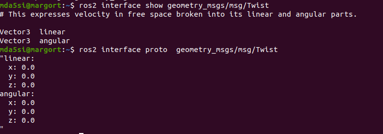

# ROSDev_Guide

This repository contains code and instructions to build understanding of ROS2 fundamentals.

  

### <u>Install ROS2</u>

  
  

### <u>Create WorkSpace</u>

	mkdir ros2_simWS

	cd ros2_simWS

	mkdir src

	colcon build

  

### <u>Configure Sources</u>

	cd ~

	nano .bashrc

Add following lines

	source /opt/ros/foxy/setup.bash

	source /home/mda5si/ros2_simWS/install/setup.bash

### <u>Add Packages to workspace</u>

	 git clone

  
  ### <u>Activity1: Controlling turtle in TurtleSim</u>
 In this activity we will use turtlesim simulator and another node that will  control 
  - Launch the turtlesim node
		  
		  ros2 run turtlesim turtlesim_node
		  
- Lunch the node to control turtle in turtle-sim
		
		ros2 run turtlesim turtle_teleop_key
  
 Keep the terminal in forground where the turtle_teleop_key node is running. You will be able to move the turtle.

### <u>Activity2: Controlling turtle in TurtleSim using  static command line publisher

The turtlesim_node can also be controlled by nodes written in python. In order to write it. We need to know the  understand which topic is responsible for messages related to movement of turtle and the format in which it takes the data.

- List available nodes
		
		ros2 node list
- List available topics
		
		ros2 topic list
- Investigate a particular topic
		
		ros2 topic info <Topic name>
		ros2 topic info /turtle1/cmd_vel

	

The topic which is associated with the movement of turtle in turtle sim is  cmd_vel. As can be seen in the picture above the Type of this topics is Twist. In order to understand the  data composition of Twist type. We investigate further.

- Investigate the composition of Twist.

  By experience we know that twist is part of geometry_msg. 

		ros2 interface show  geometry_msgs/msg/Twist
		ros2 interface proto  geometry_msgs/msg/Twist

	

  Now that we know about the topic responsible for controling the turtle and the format in which we need   to supply data. Lets publish data on the node using command line.

- Publish data using Command line

		ros2 topic pub /turtle1/cmd_vel geometry_msgs/msg/Twist "{linear:{x: 4.0, y: 0.0,z: 0.0}, angular:{x: 0.0, y: 0.0, z: 1.0}}"

### <u>Activity3: Controlling turtle in TurtleSim using python node

- Build Package

	ros2 pkg create turtlecontrol --build-type ament-python --dependencies rclpy
	

- Create file for node source code and write code.

		touch twistControl.py

- Make code executable if you want to run node directly from the python file

		chmod +x twistControl.py

- Run node 
  You can run the node directly from the python file or you can create a executable. To run the node directly do

		./twistControl.py

- Create an Executable.
  If you want to have a executable that you can run from anywhere using ros2 run <package name>< executable name>

  In the setup.pkg file. Add following

		"turtle_twist = turtlecontrol.twistControl:main"
  turtle_twist will be the name of the executable.

- Build the executable

		colcon build --packages-select turtlecontrol

  or

		colcon build --packages-select turtlecontrol --symlink-install

  This command saves us the hassle of building again when we make change to our python code for the node.

	

  The executable will be called "turtle_twist". The location of installation is mentioned in setup.cfg.

- Run the executable

	
		ros2 run turtlecontrol turtle_twist.

### <u>Activity 4  : Checking the Frequency

		ros2 topic hz <topic name>
		ros2 topic hz /turtle1_cmd_vel

### <u>Activity 5 : Checking the Bandwidth

		ros2 topic bw <topic name>
		ros2 topic bw /turtle1/cmd_vel

### <u>Activity 6: Run a new instance of a node

	ros2 run <package name><executablename> --rps-args --remap __node:=<newexecutablename>
		
