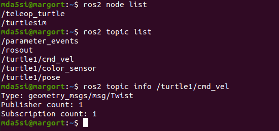

# ROSDev_Guide

This repository contains code and instructions to build understanding of ROS2 fundamentals.

  

### <u>Install ROS2</u>

  
  

### <u>Create WorkSpace</u>

	mkdir ros2_simWS

	cd ros2_simWS

	mkdir src

	colcon build

  

### <u>Configure Sources</u>

	cd ~

	nano .bashrc

Add following lines

	source /opt/ros/foxy/setup.bash

	source /home/mda5si/ros2_simWS/install/setup.bash

### <u>Add Packages to workspace</u>

	 git clone

  ## <u>Topics: Understanding how to deal with Topics
  
  ### <u>Activity1: Controlling turtle in TurtleSim</u>
 In this activity we will use turtlesim simulator and another node that will  control 
  - Launch the turtlesim node
		  
		  ros2 run turtlesim turtlesim_node
		  
- Lunch the node to control turtle in turtle-sim
		
		ros2 run turtlesim turtle_teleop_key
  
 Keep the terminal in forground where the turtle_teleop_key node is running. You will be able to move the turtle.

### <u>Activity2: Controlling turtle in TurtleSim using  static command line publisher

The turtlesim_node can also be controlled by nodes written in python. In order to write it. We need to know the  understand which topic is responsible for messages related to movement of turtle and the format in which it takes the data.

- List available nodes
		
		ros2 node list
- List available topics
		
		ros2 topic list
- Investigate a particular topic
		
		ros2 topic info <Topic name>
		ros2 topic info /turtle1/cmd_vel

	

The topic which is associated with the movement of turtle in turtle sim is  cmd_vel. As can be seen in the picture above the Type of this topics is Twist. In order to understand the  data composition of Twist type. We investigate further.

- Investigate the composition of Twist.

  By experience we know that twist is part of geometry_msg. 

		ros2 interface show  geometry_msgs/msg/Twist
		ros2 interface proto  geometry_msgs/msg/Twist

	

  Now that we know about the topic responsible for controling the turtle and the format in which we need   to supply data. Lets publish data on the node using command line.

- Publish data using Command line

		ros2 topic pub /turtle1/cmd_vel geometry_msgs/msg/Twist "{linear:{x: 4.0, y: 0.0,z: 0.0}, angular:{x: 0.0, y: 0.0, z: 1.0}}"

### <u>Activity3: Controlling turtle in TurtleSim using python node

- Create Package

	ros2 pkg create turtlecontrol --build-type ament-python --dependencies rclpy
	

- Create file for node source code and write code.

		touch twistControl.py

- Make code executable if you want to run node directly from the python file

		chmod +x twistControl.py

- Run node 
  You can run the node directly from the python file or you can create a executable. To run the node directly do

		./twistControl.py

- Create an Executable.
  If you want to have a executable that you can run from anywhere using ros2 run <package name>< executable name>

  In the setup.pkg file. Add following

		"turtle_twist = turtlecontrol.twistControl:main"
  turtle_twist will be the name of the executable.

- Build the executable

		colcon build --packages-select turtlecontrol

  or

		colcon build --packages-select turtlecontrol --symlink-install

  This command saves us the hassle of building again when we make change to our python code for the node.

	

  The executable will be called "turtle_twist". The location of installation is mentioned in setup.cfg.

- Run the executable

	
		ros2 run turtlecontrol turtle_twist.

### <u>Activity3: Controlling turtle in TurtleSim using C++ node
 
 - Create Package

		ros2 pkg create turtlecontrolcpp --build-type ament_cmake --dependencies rclcpp
		
- Create file for node source code and add code

		touch twistControl.cpp
		
- Execute the node
	
		ro2 run turtlecontrolcpp twistCPP
		
	

### <u>Activity 4  : Checking the Frequency

		ros2 topic hz <topic name>
		ros2 topic hz /turtle1_cmd_vel

### <u>Activity 5 : Checking the Bandwidth

		ros2 topic bw <topic name>
		ros2 topic bw /turtle1/cmd_vel

### <u>Activity 6: Run a new instance of a node

	ros2 run <package name><executablename> --rps-args --remap __node:=<newexecutablename>
		

## <u>Services: Understanding Services

A service is a request/response pattern where a client makes a request to a node providing the service and the service processes the request and generates a response. You generally don’t want to use a service for continuous calls; topics or even actions would be better suited.

### <u>Activity 1: List Services

	ros2 list service list
	
	ros2 list service list -t   (Also tells the type)
	

### <u>Activity2: Get the type
If you donot use the -t argument you can get the type of the service using
	
	ros2 service type <name of service>
	ros2 service type /spawn
	
	
### <u>Activity3: Get the composition of a particular type

	ros2 interface show turtlesim/srv/Spawn
	
	ros2 interfac proto turtlesim/srv/Spawn
	

	

### <u>Activity4: Call the service

	ros2 service call <service_name> <service_type> <arguments>
	ros2 service call /spawn turtlesim/srv/Spawn "{x: 4, y: 5, theta: 0.5, name: ''}"

	
## <u>Remapping
The same node without any change in the code can be run with a different name or in other words a new instance of same node can be started
This may be required to change the topic names on which they are publishing or subscribing. Also keep in mind always change the name of node when creating a new node otherwise if there are two nodes with same name it can cause unintended behaviour.

We just spawn a new turtle in previous section. This new turtle can be controlled by sending command on /turtle2/cmd_vel. But our turtle_teleop_key node by default publishes on /turtle1/cmd_vel. So we have to start a new instance of /teleop_turtle node whose name will be /telop_turtle_new and will publish on /turtle2/cmd_vel

	ros2 run turtlesim turtle_teleop_key --ros-args --remap /turtle1/cmd_vel:=/turtle2/cmd_vel --remap __node:=teleop_turtle_new

	

## <u>Interfaces
In order for two nodes to commmunicate with each other they should agree on 
 - Topic Name(ex:/number_count , /turtle1/cmd_vel)
 - Msg Defination (example_interfaces/msg/Int64  ,  geometry_msgs/msg/Twist)

Similarly for Services
 - Name of Service (ex: /reset_number_counter ,  /spawn , /turtle1/set_pen)
 - Msg Definition: There are usually 2 parts to it one is structure of request and otherone below the dotted line is response

| /rest         | /spawn        | /set_pen    |
| ------------- |:-------------:| -----------:|
| bool data     | float32 x     | uint8 r     |
|               | float32 x     | uint8 g     |
|               | float32 theta | uint8 b     |
|               |               | uint8 width |
|               |               | uint8 off   |
|               |               |             |
|               |               |             |
| ------------- | ------------- | ----------- |
| bool success  | string name   |             |
 		
### Activity: A custom Interface creation

- Create a package. By default creates a C package

	ros2 pkg create rex_interfaces
	
### Remove the unwanted folders

	rm -rf includes 
	rm -rf src
	mkdir msg

### Edit packages.xml

	<build_depend> rosidl_default_generators</build_depend>
	<exec_depend>rosidl_default_runtime<exec_depend>
	<member_of_group>rosidl_interface_packages</member_of_group>

### Edit cmakeLiss.txt
	
	find_package(
		rosidl_default_generators REQUIRED)
	rosidl_generate_interfaces(${PROJECT_NAME}
 	"msg/RobotData.msg"
	)
	
	
		
### Transfroms

- Download packages
		
		sudo apt-get install ros-foxy-turtle-tf2-py ros-foxy-tf2-tools ros-foxy-tf-transformations
	
- Another package for euler angles

		pip3 install transforms3d
	
- Launch

		ros2 launch turtle_tf2_py turtle_tf2_demo.launch.py
	

  ### Control Robot in Gazebo
  
  - Packages
  	sudo apt-get install ros-foxy-teleop-twist-keyboard
  - Run the package
  
  	ros2 run teleop_twist_keyboard teleop_twist_keyboard
